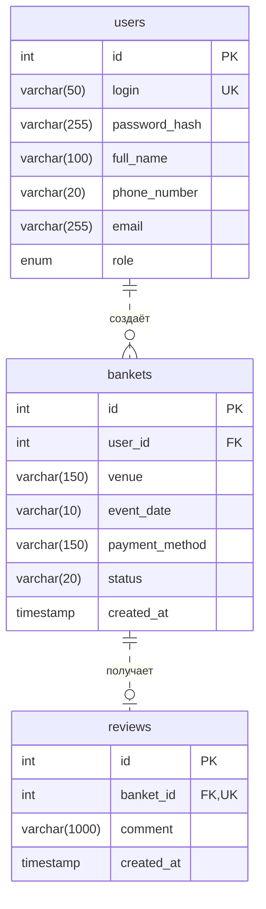

```mermaid
erDiagram
    users ||..o{ bankets : "создаёт"
    bankets ||..o| reviews : "получает"
    users {
        int id PK
        varchar(50) login UK
        varchar(255) password_hash
        varchar(100) full_name
        varchar(20) phone_number
        varchar(255) email
        enum role
    }
    bankets {
        int id PK
        int user_id FK
        varchar(150) venue
        varchar(10) event_date
        varchar(150) payment_method
        varchar(20) status
        timestamp created_at
    }
    reviews {
        int id PK
        int banket_id FK, UK
        varchar(1000) comment
        timestamp created_at
    }
```